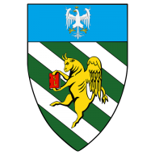

<!-- PROJECT SHIELDS -->
<!-- These badges can be used once we make the project public -->
<!-- [![Contributors][contributors-shield]][contributors-url]
[![Forks][forks-shield]][forks-url]
[![Stargazers][stars-shield]][stars-url]
[![Issues][issues-shield]][issues-url]
[![MIT License][license-shield]][license-url]-->

<!-- PROJECT LOGO -->
<br />
<p align="center">
  <a href="https://github.com/Compagnia-d-Arme-del-Santo-Luca/website">
    
  </a>

  <h2 align="center">Compagnia d'Arme del Santo Luca Website</h2>

  <p align="center">
    Ass. di rievocazione storica affiliata C.E.R.S. (XIV-XV secolo)
    <br />
    <a href="#Contacts">Contact us</a>
    ·
    <a href="https://github.com/Compagnia-d-Arme-del-Santo-Luca/website/issues">Request Feature</a>
    ·
    <a href="https://github.com/Compagnia-d-Arme-del-Santo-Luca/website/issues">Report Bug</a>
    <br />
    <a href="#documentation"><strong>Explore the docs »</strong></a>
  </p>
</p>

<!-- [![LinkedIn][linkedin-shield]][linkedin-url] -->

[](https://github.com/Compagnia-d-Arme-del-Santo-Luca/website/actions/workflows/release.yml)
[](https://github.com/Compagnia-d-Arme-del-Santo-Luca/website/actions/workflows/deploy.yml)
[](./.github/workflows/build.yml)

<!-- [](https://codecov.io/github/Compagnia-d-Arme-del-Santo-Luca/website) -->

<!-- TABLE OF CONTENTS -->
<details open="open">
  <summary>Table of Contents</summary>
  <ol>
    <li>
      <a href="#about-the-project">About The Project</a>
    </li>
    <li>
      <a href="#getting-started">Getting Started</a>
      <!-- <ul>
        <li><a href="#prerequisites">Prerequisites</a></li>
        <li><a href="#installation">Installation</a></li>
      </ul> -->
    </li>
    <li><a href="#usage">Usage</a></li>
    <!-- <li><a href="#documentation">Docs</a></li> -->
    <li><a href="#roadmap">Roadmap</a></li>
    <li><a href="#contributing">Contributing</a></li>
    <!-- <li><a href="#license">License</a></li> -->
    <li><a href="#contacts">Contacts</a></li>
    <!-- <li><a href="#acknowledgements">Acknowledgements</a></li> -->
  </ol>
</details>

<!-- ABOUT THE PROJECT -->

## About The Project

This is where we develop Compagnia d'Arme del Santo Luca's website.

## Getting Started

There are two ways to run the project: using a devcontainer or running it locally. We recommend using the devcontainer, as it ensures that the project runs in a consistent environment.

### Devcontainer

The project is configured to run in a devcontainer. To use it, you need to have Docker and Visual Studio Code installed.

1. Install the [Remote - Containers](https://marketplace.visualstudio.com/items?itemName=ms-vscode-remote.remote-containers) extension for Visual Studio Code.
2. Open the project in Visual Studio Code.
3. Click on the green icon in the bottom left corner of the window.
4. Select "Reopen in Container".

### Local

To get a local copy up and running follow these simple example steps.

#### Prerequisites

We only support the latest lts version of Node and npm.

You can use [`nvm`](https://github.com/nvm-sh/nvm) to obtain both of them:

```bash
# install the lastest version of nvm
release_url=$(curl -Ls -o /dev/null -w %{url_effective} https://github.com/nvm-sh/nvm/releases/latest)
release_tag=$(basename $release_url)
curl -o- https://raw.githubusercontent.com/nvm-sh/nvm/$release_tag/install.sh | bash
unset release_url release_tag
source ~/.bashrc

#  use nvm to install latest lts version of node and npm
nvm install --lts
```

#### Installation

Few steps are required to be up and running:

1. clone the repository:

   ```bash
   git clone git@github.com:Compagnia-d-Arme-del-Santo-Luca/website.git
   cd website
   ```

2. Install the dependencies in the local node_modules folder:

   ```bash
   npm ci
   ```

## Usage

In the project directory, you can run:

- `npm start`

  Runs the app in the development mode.\
   Open <http://localhost:5173> to view it in the browser.

  The page will reload if you make edits.\
   You will also see any lint errors in the console.

<!--
- `npm run storybook`
  Starts Storybook locally and output the address. It will automatically open <http://localhost:6006> to view it in the browser.
-->

- `npm run test`

  Launches the test runner in the interactive watch mode.\
   See the section about [running tests](https://facebook.github.io/create-react-app/docs/running-tests) for more information.

- `npm run test:coverage`

  Launches the test runner with coverage report.

- `npm run build`

  Builds the app for production to the `build` folder.\
   It correctly bundles React in production mode and optimizes the build for the best performance.

  The build is minified and the filenames include the hashes.\
   Your app is ready to be deployed!

  See the section about [deployment](https://vitejs.dev/guide/static-deploy) for more information.

<!--
- `npm run build:storybook`

  Builds Storybook as a static web application.
-->

- `npm run serve`

  Preview the app in the production mode.\
   Open <http://localhost:4173> to view it in the browser.

<!--
## Documentation

Static documentation for of the React components is available as Storybook stories and is stored in the `docs` directory.
It can be accessed and viewed locally as follow:

1. clone the repo and navigate to the docs folder:

   ```bash
   git clone git@github.com:Compagnia-d-Arme-del-Santo-Luca/website.git
   cd website/docs
   ```

2. start a local python HTTP server:

   ```bash
   python -m http.server
   ```

3. open <http://0.0.0.0:8000/> from a browser

For the latest version, you can start Storybook locally using `npm storybook`. It will automatically open <http://localhost:6006> to view it in the browser.
-->

<!-- ROADMAP -->

## Roadmap

See the [open issues](https://github.com/Compagnia-d-Arme-del-Santo-Luca/website/issues) for a list of proposed features (and known issues). See the [Roadmap kanban](https://github.com/orgs/Compagnia-d-Arme-del-Santo-Luca/projects/1) for the state of the development.

<!-- CONTRIBUTING -->

## Contributing

Contributions are what make the open source community such an amazing place to learn, inspire, and create. Any contributions you make are **greatly appreciated**.

**IMPORTANT:** If you beleve you've found a security vulnerabilities, please follow our [Security Policy](./SECURITY.md) and **do not** report it through public GitHub issues and PRs.

For all other contributions:

1. Fork the Project
2. Create your Feature Branch (`git checkout -b feat/AmazingFeature`)
3. Commit your Changes (`git commit -m 'Add some AmazingFeature'`)
4. Push to the Branch (`git push origin feat/AmazingFeature`)
5. Open a Pull Request

<!-- TODO:LICENSE - ->
## License

Distributed under the MIT License. See `LICENSE` for more information. -->

<!-- CONTACTS -->

## Contacts

Compagnia d'Arme del Santo Luca - [compagniasantoluca@gmail.com](mailto:compagniasantoluca@gmail.com)

Project Link: [Github](https://github.com/Compagnia-d-Arme-del-Santo-Luca/website)

<!-- ACKNOWLEDGEMENTS - ->
## Acknowledgements -->

<!-- MARKDOWN LINKS & IMAGES -->
<!-- These will be used once we make the project public -->
<!-- https://www.markdownguide.org/basic-syntax/#reference-style-links -->

<!--
[contributors-shield]: https://img.shields.io/github/contributors/Compagnia-d-Arme-del-Santo-Luca/website.svg?style=for-the-badge
[contributors-url]: https://github.com/Compagnia-d-Arme-del-Santo-Luca/website/graphs/contributors
[forks-shield]: https://img.shields.io/github/forks/Compagnia-d-Arme-del-Santo-Luca/website.svg?style=for-the-badge
[forks-url]: https://github.com/Compagnia-d-Arme-del-Santo-Luca/website/network/members
[stars-shield]: https://img.shields.io/github/stars/Compagnia-d-Arme-del-Santo-Luca/website.svg?style=for-the-badge
[stars-url]: https://github.com/Compagnia-d-Arme-del-Santo-Luca/website/stargazers
[issues-shield]: https://img.shields.io/github/issues/Compagnia-d-Arme-del-Santo-Luca/website.svg?style=for-the-badge
[issues-url]: https://github.com/Compagnia-d-Arme-del-Santo-Luca/website/issues
[license-shield]: https://img.shields.io/github/license/Compagnia-d-Arme-del-Santo-Luca/website.svg?style=for-the-badge
[license-url]: https://github.com/Compagnia-d-Arme-del-Santo-Luca/website/blob/master/LICENSE.txt
[linkedin-shield]: https://img.shields.io/badge/-LinkedIn-black.svg?style=for-the-badge&logo=linkedin&colorB=555
[linkedin-url]: https://www.linkedin.com/company/robosintesi
-->
